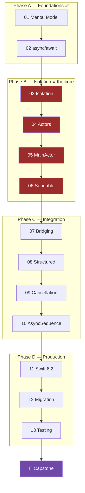

# Swift Modern Concurrency — Roadmap

> **Start here.** While coding: [[00 - Decision Procedure]] · Terms: [[Glossary]] ·
> Tracker: [[Progress]] · Links: [[Resources]] · Scratch project: [[Lab Setup]]

---

## 1. What changed, and why

The previous version of this curriculum was **read → quiz**, in textbook order, with 10 of 12
modules locked behind a gate.

Two problems with that:

**The order was wrong for the goal.** Isolation, actors, `@MainActor` and `Sendable` — the
four things that cause the "what is happening, what do I do now" feeling — were modules 5–8,
locked. You were gated *out* of exactly the material that answers the question you actually
have.

**The loop was wrong.** Quizzes train recall. But confusion while implementing isn't a recall
failure — you can already define an actor. It's the absence of a **decision procedure**, and
that only comes from writing code that fails to compile and understanding why.

So: reordered around implementation pain, and **every gate is now a compiler, not a quiz.**

---

## 2. The rule that makes this work

> **Turn on strict concurrency before module 03, not at the end.**

```
SWIFT_STRICT_CONCURRENCY = complete
```

This is the single highest-leverage change in the entire plan. With it on, every place you
would have been confused becomes a compiler error with a **file, a line, and a named value**.
"What is happening here?" becomes "Sending 'self' risks causing data races at line 42."

That is the difference between fog and a task list. You cannot get this from notes, and it is
why the old plan's "flip to Swift 6 in module 11" was backwards. Setup: [[Lab Setup]].

---

## 3. Module map

| # | Module | The question it answers |
| :--- | :--- | :--- |
| | **Phase A — Foundations** *(already done)* | |
| 01 | [[01 - Mental Model]] | What actually runs my code, and what does "suspend" mean? |
| 02 | [[02 - Async Await Deep Dive]] | What is and isn't guaranteed across an `await`? |
| | **Phase B — Isolation** *(the core; where your confusion lives)* | |
| 03 | [[03 - Isolation - The Core Concept]] | **Where does this code run, and how do I know?** |
| 04 | [[04 - Actors]] | How do I protect mutable state, and what is reentrancy? |
| 05 | [[05 - MainActor and Global Actors]] | How does `@MainActor` propagate, and when do I fight it? |
| 06 | [[06 - Sendable and Data-Race Safety]] | What may cross a boundary, and why won't this compile? |
| | **Phase C — Integration** *(doing real work)* | |
| 07 | [[07 - Bridging Legacy Code]] | How do I wrap delegates, completion handlers, and GCD? |
| 08 | [[08 - Structured Concurrency]] | How do I run things in parallel and keep errors sane? |
| 09 | [[09 - Tasks, Cancellation and Priority]] | When do I use `Task {}`, and how does cancellation really work? |
| 10 | [[10 - AsyncSequence and AsyncStream]] | How do I model values arriving over time? |
| | **Phase D — Production** *(shipping it)* | |
| 11 | [[11 - Swift 6.2 and Modern Defaults]] | What changed in 6.2, and why does my code behave differently? |
| 12 | [[12 - Migrating to Swift 6]] | How do I turn this on in a real codebase without a rewrite? |
| 13 | [[13 - Testing Concurrent Code]] | How do I test async code without flakiness? |



**Why this order.** Phase B is the keystone and it comes first because *every* confusing error
message is an isolation error wearing a costume. Note that module 03 — Isolation — did not
exist in the old plan at all. That absence is precisely why the material felt like
disconnected facts: you had the vocabulary for actors and `Sendable` without the concept
that unifies them.

---

## 4. The gate: drills, not quizzes

Each module has a matching drill in [[Drills - How They Work]]. A module is **done** when:

1. ✅ The drill code **compiles under `SWIFT_STRICT_CONCURRENCY = complete`**
2. ✅ You produced the **failure** the drill asks for — the error, race, hang or crash — and
   can explain it in one sentence *before* reading the explanation
3. ✅ You wrote what you got wrong in the **Error Log** in [[Progress]]

Point 2 is the one that matters. Making correct code is a weak signal — you can copy that.
**Deliberately breaking it and predicting the breakage** is the signal that you understand the
model. Every drill is built around producing a specific failure on purpose.

> There is no 80% pass mark any more, because there's nothing to score. The compiler either
> accepts it or it doesn't, and you can either explain the error or you can't.

---

## 5. Suggested pace

Six weeks at roughly an hour a day. Adjust freely, but **don't reorder Phase B** — 03→04→05→06
is a dependency chain, not a preference.

| Week | Work | Outcome |
| :--- | :--- | :--- |
| 0 | [[Lab Setup]] + [[00 - Decision Procedure]] | Scratch project with strict concurrency on |
| 1 | Modules 03, 04 | You can answer "where does this run?" for any code |
| 2 | Modules 05, 06 | `Sendable` errors stop being mysterious |
| 3 | Modules 07, 08 | You can migrate real legacy code |
| 4 | Modules 09, 10 | Cancellation and streams |
| 5 | Modules 11, 12 | Migrate one real module of a real app |
| 6 | Module 13 + [[Capstone]] | Tested, shipped, Swift 6 clean |

**Re-read [[02 - Async Await Deep Dive]] §4 after module 04.** Reentrancy is the one topic
that only makes sense the second time, once you've seen an actor.

---

## 6. The one-paragraph version

Swift concurrency replaces *threads you manage* with *tasks the runtime schedules* on a small,
fixed-size **cooperative thread pool**. `await` marks a **suspension point** where your
function gives up its thread and may resume on a different one. Because work moves between
threads, the compiler must know which code owns which mutable state — that's **isolation**
(an actor, a global actor like `@MainActor`, or nothing) — and which values are safe to move
between those domains — that's **`Sendable`**. Swift 6 language mode turns those checks from
warnings into errors, which is how you get compile-time data-race safety.

Everything else is detail on that paragraph. If you can say it in your own words without
looking, Phase B has done its job.

---

## 7. What "done" looks like

You're finished when you can, without looking anything up:

- [ ] Name the isolation of any declaration you're looking at, and say how you know
- [ ] Read a Swift 6 concurrency error and know the fix before finishing the sentence
- [ ] Explain why `Task { }` inside a `@MainActor` function still runs on the main actor
- [ ] Write an actor that doesn't have a reentrancy bug — and say where the bug *would* be
- [ ] Wrap a delegate-based API in `AsyncStream` from memory
- [ ] Cancel an in-flight request correctly when a SwiftUI view disappears
- [ ] Take a Swift 5 module to Swift 6 language mode without `@unchecked Sendable`
- [ ] Explain to a colleague why their `DispatchSemaphore` fix will deadlock in production

That last one is the real bar. Teaching it is the test.
