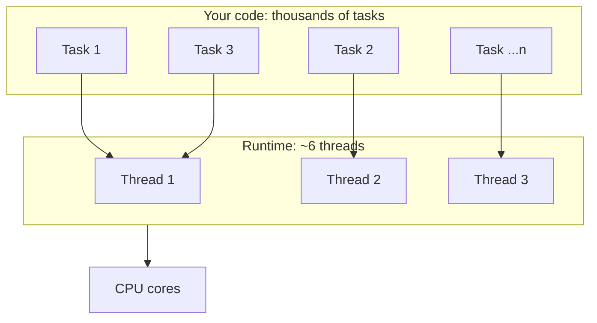

# Module 01 — The Mental Model

> Terms: [[Glossary]] · Next: [[02 - Async Await Deep Dive]]
> **Goal:** stop thinking in threads. By the end you should be able to say precisely what
> runs your code, what "suspend" means, and why `await` is not `wait`.

---

## 1. What problem this solves

Before 2021, iOS concurrency meant GCD and completion handlers. Three things were wrong with that, and every feature in modern Swift concurrency is a response to one of them.

### Problem 1 — the pyramid of doom

```swift
func loadProfile(id: String, completion: @escaping (Result<Profile, Error>) -> Void) {
    fetchUser(id: id) { userResult in
        switch userResult {
        case .failure(let e): completion(.failure(e))          // ← error plumbing #1
        case .success(let user):
            fetchAvatar(user.avatarURL) { avatarResult in
                switch avatarResult {
                case .failure(let e): completion(.failure(e))  // ← error plumbing #2
                case .success(let avatar):
                    fetchSettings(user.id) { settingsResult in
                        switch settingsResult {
                        case .failure(let e): completion(.failure(e))  // ← #3
                        case .success(let settings):
                            completion(.success(Profile(user, avatar, settings)))
                        }
                    }
                }
            }
        }
    }
}
```

Note what the compiler *cannot* help with here:

- Nothing forces you to call `completion`. Forget one branch and the caller hangs forever.
- Nothing stops you from calling it **twice**.
- `throws` doesn't work. You hand-roll `Result` and re-plumb the error at every level.
- You can't `return` a value, so the type system can't describe the flow.

### Problem 2 — thread explosion

GCD's rule: if a queue has work to do and all its threads are blocked, spin up another
thread. That's fine until it isn't.

```swift
// The classic disaster
for url in thousandsOfURLs {
    DispatchQueue.global().async {
        let data = try? Data(contentsOf: url)  // synchronous, BLOCKS the thread
        process(data)
    }
}
```

Each blocked thread costs ~512 KB–1 MB of stack plus kernel bookkeeping. GCD keeps creating
threads because it sees blocked ones. You end up with 64+ threads, all asleep, the scheduler
thrashing between them — and the app is slower than if you'd used one thread.

### Problem 3 — no data-race safety

```swift
var cache: [String: Data] = [:]
DispatchQueue.global().async { cache["a"] = dataA }
DispatchQueue.global().async { cache["b"] = dataB }   // 💥 crash or corruption, silently
```

The compiler had no idea these two closures could run at once. Correctness depended entirely
on you remembering to put a queue or lock around every access. Modules
[[06 - Sendable and Data-Race Safety]] and [[04 - Actors]] are the fix; keep the problem in
mind until then.

---

## 2. Three words people use interchangeably (and shouldn't)

This is worth being pedantic about, because the rest of the curriculum leans on the
distinction.

| Term            | Meaning                                                        | Requires multiple cores? |
| :-------------- | :------------------------------------------------------------- | :----------------------- |
| **Concurrency** | Multiple tasks *in progress* over the same period, interleaved | No                       |
| **Parallelism** | Multiple tasks *executing at the same instant*                 | Yes                      |
| **Threading**   | A specific OS-level *mechanism* for achieving either           | —                        |

A single-core machine can be highly concurrent and zero-parallel. Swift's model is about
**concurrency**; parallelism is an optimisation the runtime applies when cores are free.

```mermaid
gantt
    title Concurrency vs Parallelism (same two tasks)
    dateFormat X
    axisFormat %s
    tickInterval 1second

    section Concurrent (1 core)
    Task A part 1   :active, 0, 1
    Task B part 1   :done,   1, 2
    Task A part 2   :active, 2, 3
    Task B part 2   :done,   3, 4

    section Parallel (2 cores)
    Task A          :active, 0, 2
    Task B          :done,   0, 2
```



Practical consequence: `await` gives you **concurrency**. If you want a real chance of
**parallelism**, you need `async let` or a task group ([[08 - Structured Concurrency]]) —
because those create *separate tasks*, and only separate tasks can occupy separate cores.

---

## 3. The cooperative thread pool

Swift's runtime maintains a pool with **roughly one thread per CPU core**. Not per queue.
Not growable on demand. On an iPhone that's around 6.

Why fixed? Because the number of threads that can *actually make progress* at once is the
number of cores. Any thread beyond that is pure overhead: memory for its stack, plus context
switches. GCD's growable pool was solving the wrong problem — it grew because threads were
*blocked*, and the real fix is to never block.

The pool is called **cooperative** because the Swift runtime does not preempt a running
job: a task runs until it voluntarily gives up its thread by **suspending**. (The OS can
still preempt the *thread*; that is not the same thing.) That's a bargain, and your side
of it is:

> **The runtime contract:** never block a cooperative pool thread.

Concretely, inside async code, never use:

| ❌ Don't | ✅ Do instead |
| :--- | :--- |
| `Thread.sleep(forTimeInterval:)` | `try await Task.sleep(for: .seconds(1))` |
| `DispatchSemaphore.wait()` | restructure with `await` |
| `DispatchQueue.sync { }` | `await` the isolated call |
| `Data(contentsOf: url)` (network URL) | `try await URLSession.shared.data(from:)` |
| A spin loop / busy-wait | `await Task.yield()` at minimum |

Break the contract and you don't just slow things down — you can **deadlock the entire app**.
With ~6 threads, six blocked tasks can leave zero threads available to run the very work
they're waiting on. This is the single most important practical takeaway of this module.

---

## 4. Tasks, not threads

The unit of work is a **Task**, not a thread.



Key properties:

- **Cheap.** A task is a heap allocation, not an OS thread. Thousands are fine.
- **Not bound to a thread.** A task can start on thread 3, suspend, and resume on thread 1.
- **Tree-structured.** Tasks have parents and children; cancellation flows down the tree
  ([[08 - Structured Concurrency]]).
- **Carries context.** Priority, cancellation state, task-local values, and isolation travel
  with the task, not the thread.

That third-to-last point deserves emphasis, because it invalidates a habit:

> **A task is not pinned to a thread.** Anything you stored in thread-local storage, or any
> logic that reads `Thread.current`, is meaningless in async code.

### 4.1 — Isolation propagates. Threads do not.

This is the correction that most people need twice before it sticks, so it gets its own
heading.

"I called it from the main thread, so it runs on the main thread" is **not a mechanism**.
Nothing in Swift concurrency reads the current thread and carries it forward. What determines
where your code runs is **isolation**, which is a property of the *declaration* — decided at
compile time, not at call time.

`Task { }` does inherit things from its enclosing scope: priority, task-local values, and
actor isolation. But it inherits the isolation of the **lexical context**, not the identity of
whatever thread happened to be executing.

The counterexample that proves it — a nonisolated function, physically executing on the main
thread, spawning a task that does *not* run on main:

```swift
nonisolated func spawn() {
    print(Thread.isMainThread)          // true  — we really are on the main thread
    Task {
        print(Thread.isMainThread)      // false — the enclosing CONTEXT was nonisolated
    }
}
```

And the reverse: a `@MainActor` function runs on the main thread even from `Task.detached`,
which inherits nothing at all. Isolation won because isolation is the only thing that was ever
in play.

> **Test yourself:** if you can only remember one sentence from this module, make it
> *"where code runs is decided by the isolation of the declaration, not by the caller's thread."*

### 4.2 — ⚠️ Xcode 26 changes the default, and it will confuse your experiments

New projects created by Xcode 26 ship with these in Build Settings:

```
SWIFT_DEFAULT_ACTOR_ISOLATION = MainActor   ← "Default Actor Isolation"
SWIFT_APPROACHABLE_CONCURRENCY = YES        ← "Approachable Concurrency"
```

The first means **every unannotated declaration in your module is implicitly `@MainActor`**.
A bare `func foo() async` is really `@MainActor func foo() async`.

The second enables `NonisolatedNonsendingByDefault`, which means a `nonisolated` **async**
function runs on **the caller's** executor rather than hopping to the global pool.

Together they produce a world where almost nothing leaves the main thread unless you say so.
Measured on the same source file, called from a main-actor context:

| Declaration | Xcode 26 defaults | Plain Swift 5 (no settings) |
| :--- | :--- | :--- |
| `func foo() async` | 🟢 main thread | ⚪️ background |
| `nonisolated func foo() async` | 🟢 main thread | ⚪️ background |
| `@concurrent nonisolated func foo() async` | ⚪️ background | ⚪️ background |
| `func foo() async` via `Task.detached` | 🟢 **main thread** | ⚪️ background |

That last row is the giveaway: `Task.detached` inherits *nothing*, and the function still runs
on main — because `@MainActor` was baked into the declaration, not passed down from the caller.

**This is a good default for app code** (UI-adjacent code belongs on the main actor, and this
removes a huge class of spurious Swift 6 errors). But it will make thread-hopping exercises
appear to "not work". If you want to see hops, either add `@concurrent`, or set *Default Actor
Isolation* to `nonisolated` in Build Settings. Full treatment in [[11 - Swift 6.2 and Modern Defaults]].

---

## 5. What "suspend" actually means

Here is the mechanical answer, and it's the thing most tutorials skip.

A synchronous function's local state lives on the **thread's stack**. If the function pauses,
the thread is stuck holding that stack frame — that's what blocking *is*.

The Swift compiler transforms an `async` function into a **state machine**. Its local state
lives in a heap-allocated **async frame** owned by the task, not by any thread. So:

```swift
func loadProfile() async throws -> Profile {
    let user = try await fetchUser()        // ← suspension point 1
    let avatar = try await fetchAvatar(user.avatarURL)  // ← suspension point 2
    return Profile(user, avatar)
}
```

becomes, conceptually:

```
State 0: call fetchUser, register a continuation, RELEASE THE THREAD
         ── thread now runs completely unrelated tasks ──
State 1: (resumed) store `user`, call fetchAvatar, RELEASE THE THREAD
         ── thread runs other work again ──
State 2: (resumed) store `avatar`, build Profile, return to caller
```

The "where do I pick up from" record is called a **continuation**. Every `await` is a place
where the task's continuation is saved and the thread is handed back to the pool.

### The consequences you must internalise

1. **`await` releases the thread; it does not block it.** While `loadProfile` is waiting on
   the network, that thread is doing other useful work. This is exactly what GCD's blocking
   calls could not do.

2. **The thread you resume on is probably not the one you left from.** Never write logic that
   depends on thread identity.

3. **Anything can happen at an `await`.** Other tasks run. State you read *before* the
   `await` may be stale *after* it. This is the source of nearly every subtle concurrency
   bug, and it's the main subject of [[02 - Async Await Deep Dive]].

4. **Between two `await`s, your code is atomic within its isolation domain.** No other code
   in that same domain can interleave. This is a real guarantee you can rely on — and it's
   why the compiler forces `await` to be visible in the source. Every suspension point is
   marked, so "where can things change?" is answerable by reading.

---

## 6. Putting it together — the same function, both worlds

```swift
// ─── GCD ───────────────────────────────────────────────────────────────
func loadProfile(id: String, completion: @escaping (Result<Profile, Error>) -> Void) {
    fetchUser(id: id) { result in
        switch result {
        case .failure(let e): completion(.failure(e))
        case .success(let user):
            fetchAvatar(user.avatarURL) { avatarResult in
                switch avatarResult {
                case .failure(let e): completion(.failure(e))
                case .success(let avatar):
                    completion(.success(Profile(user: user, avatar: avatar)))
                }
            }
        }
    }
}

// ─── Swift concurrency ─────────────────────────────────────────────────
func loadProfile(id: String) async throws -> Profile {
    let user = try await fetchUser(id: id)
    let avatar = try await fetchAvatar(user.avatarURL)
    return Profile(user: user, avatar: avatar)
}
```

What you got back, item by item:

- **Real return values.** The function's type describes what it does.
- **Real `throws`.** One `try`, errors propagate up automatically. No `Result` plumbing.
- **Compiler-enforced completeness.** You cannot "forget to call the completion handler" —
  falling off the end of a non-`Void` function is a compile error.
- **Visible suspension points.** Two `await`s means exactly two places where the world can
  change underneath you.
- **No blocked threads.** Both waits release the thread.

---

## 7. Pitfalls

**7.1 — "`await` means wait, so my code is slower."**
No. `await` releases the thread. And these two are *not* the same:

```swift
let a = try await fetchA()   // sequential: 1s
let b = try await fetchB()   // then 1s  → total 2s

async let a = fetchA()       // concurrent: both start now
async let b = fetchB()
let (x, y) = try await (a, b)  // → total ~1s
```

Sequential `await`s are sequential *on purpose*. Concurrency is opt-in via `async let` and
task groups. Don't assume you got parallelism just because you typed `await`.

**7.2 — Reaching for `DispatchSemaphore` to "call async code from sync code."**

```swift
// ☠️ Never do this
func syncWrapper() -> Data {
    let sem = DispatchSemaphore(value: 0)
    var result: Data!
    Task { result = try! await fetch(); sem.signal() }
    sem.wait()          // blocks a pool thread — can deadlock the whole app
    return result
}
```

This is the number one way teams break their app during migration. The correct answer is to
make the caller `async`, or use `Task { }` and handle the result asynchronously
([[09 - Tasks, Cancellation and Priority]]).

**7.3 — Assuming `Thread.current` or thread-local storage still works.** Tasks migrate
between threads at every suspension point. Any logging, analytics, or DI that keys off the
current thread is broken in async code. Use **task-local values** instead
([[09 - Tasks, Cancellation and Priority]]).

**7.4 — Expecting `await` to hop you back to the main thread.** It doesn't, by itself. Where
your code runs is determined by **isolation**, not by `await` — that's
[[03 - Isolation - The Core Concept]]. For now: if you touch UI, you need `@MainActor`.

**7.5 — Thinking "async" implies "background".** It doesn't. An `async` function called from
`@MainActor` code may run entirely on the main actor. `async` describes *the ability to
suspend*, not *where the work happens*.

---

## 8. Exercises

Do these in a playground or a scratch app target. Reading isn't enough
— the mental model only sticks once you've watched it behave.

**8.1 — Watch a task change threads.**
Write an async function that prints `Thread.isMainThread` before and after a
`try await Task.sleep(for: .milliseconds(100))`. Call it from `Task { }`.

**Before you conclude anything, check Build Settings → *Default Actor Isolation*** (see §4.2).
If it's `MainActor`, your function is implicitly `@MainActor` and will never leave the main
thread — the experiment is measuring the build setting, not the runtime. Run all four rows of
the §4.2 table yourself: plain, `nonisolated`, `@concurrent`, and via `Task.detached`. Predict
each before running.

*(`Thread.current` warns under strict concurrency — which is itself the point: the API is
meaningless in this world. Prefer `Thread.isMainThread`.)*

**8.2 — Prove `await` doesn't block.**
Start 100 tasks in a loop, each printing its index, sleeping 1 second via `Task.sleep`, then
printing "done \(i)". Time the whole thing. Then rewrite using `Thread.sleep` instead and time
it again. Explain the difference in terms of the cooperative pool. *(Do not run the second
version inside a real app you care about.)*

**8.3 — Sequential vs concurrent.**
Write two async functions that each `Task.sleep` for 1 second and return an `Int`. Call them
two ways: two sequential `await`s, then `async let` + `await`. Measure both with
`ContinuousClock().measure { }`. Predict the numbers *before* you run it.

**8.4 — Count suspension points.**
Take this function and, without running it, list every place execution could suspend. Then
state what could have changed about the outside world at each one.

```swift
func refresh() async throws -> [Item] {
    let token = try await auth.currentToken()
    let raw = try await api.fetchItems(token: token)
    let decoded = decode(raw)                     // synchronous
    try await cache.store(decoded)
    return decoded
}
```

---

## 9. Gate

> ⚠️ This module predates the drill format.

Do the exercises in §8, then move to [[03 - Isolation - The Core Concept]]. §4.1 and §4.2 of
this module are the bridge into it: if "isolation propagates, threads do not" doesn't feel
obvious yet, module 03 is where it becomes so.
