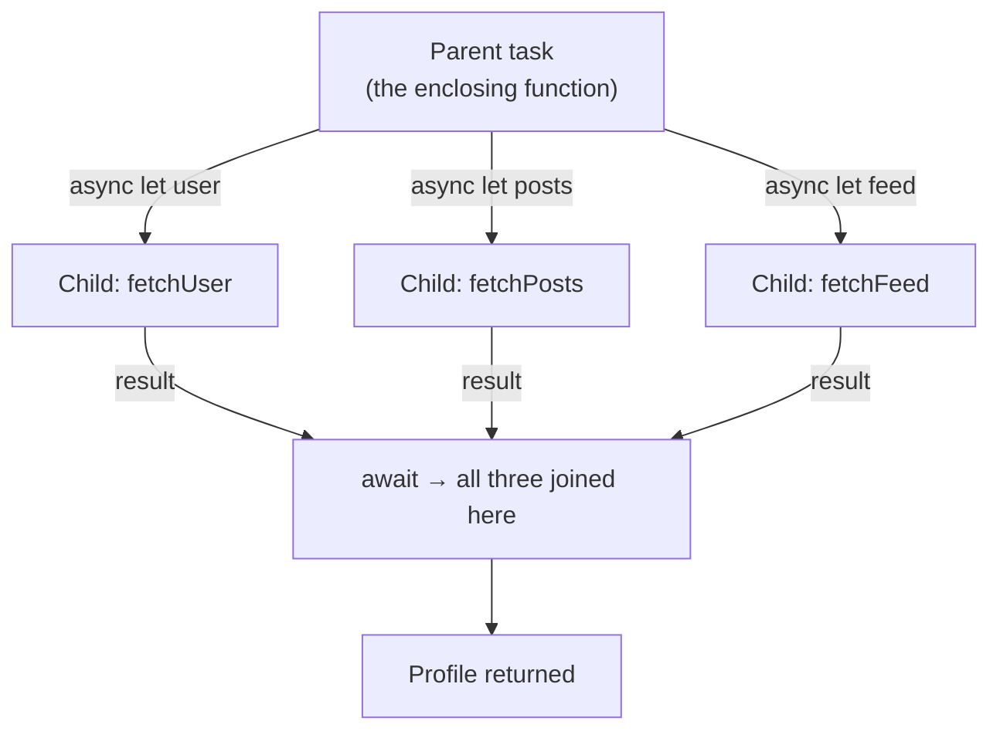

# Module 02 — async / await in Depth

> Terms: [[Glossary]] · Prev: [[01 - Mental Model]]
> **Goal:** know exactly what is guaranteed and what is *not* guaranteed across an `await`,
> and be able to spot a reentrancy bug by reading.

You already know the syntax. This module is about the semantics underneath it — the part
that decides whether your code is correct.

---

## 1. The colouring rule

`async` is **viral**, in the same way `throws` is:

```swift
func a() async { }
func b() async { await a() }      // ✅ async can call async
func c()       { await a() }      // ❌ 'async' call in a function that does not support concurrency
```

The rule: **an `async` function can only be called from an async context.** Async contexts are:

1. The body of another `async` function.
2. The body of a `Task { }` / `Task.detached { }` closure.
3. The body of a `@main` async `main()`.
4. A `withTaskGroup` child closure or `async let` initialiser.
5. Certain framework hooks — SwiftUI's `.task { }`, `refreshable { }`, `swift-testing`'s
   `@Test func … async`, `XCTest`'s `async` test methods.

That's it. There is deliberately **no** blocking bridge from sync to async in the language.
If you find yourself wanting one, see pitfall 7.2 in [[01 - Mental Model]] — the answer is
always to restructure, not to block.

### `async` in the type system

`async` is part of a function's type, and it composes with `throws` in a fixed order:

```swift
func f() async throws -> Int
//     ─────┬───── ──┬───
//       effects     order is always: async, then throws, then ->

let fn: () async throws -> Int = f     // function values carry the effects
```

You can go "up" the effect ladder but not down — a non-async, non-throwing function can be
used where an `async throws` one is expected:

```swift
func plain() -> Int { 42 }
let g: () async throws -> Int = plain   // ✅ fine, adding effects is safe
```

### `rethrows`-style flexibility: `reasync`?

There is no user-facing `reasync`. But the standard library's higher-order functions get the
same effect via **typed effects on the closure parameter**:

```swift
let names = ["a", "b"]
let lengths = try await names.asyncMap { try await lookupLength($0) }  // your own helper
// but note: `names.map { }` cannot take an async closure — Sequence.map is not reasync.
```

This is why you often *can't* just drop `await` into a `map`/`filter`/`forEach` chain, and
why `for await` and task groups exist ([[08 - Structured Concurrency]]).

---

## 2. Where suspension points actually are

The compiler makes them visible. In Swift, a task may suspend at exactly these places:

| Construct | Suspends? |
| :--- | :--- |
| `await someAsyncCall()` | Yes — **may** suspend |
| `try await …` | Yes |
| Reading an `async let` variable (`await x`) | Yes |
| `for await x in stream` (each iteration) | Yes |
| `await` on an actor-isolated member from outside | Yes (a **hop**) |
| A plain synchronous call | No |
| A property access on a non-isolated value | No |

Two subtleties people get wrong:

**"May" suspend, not "will".** If the awaited work is already complete, or the call doesn't
need to change isolation, the runtime can continue on the same thread with no suspension at
all. You must *assume* it might, but you can't *rely* on it doing so. Never write code whose
correctness depends on a suspension actually happening.

**One `await` keyword can cover several suspension points.** The keyword is not per-call —
it applies to the *entire expression* to its right, and the compiler rejects an `await` sitting
to the right of a non-assignment operator:

```swift
let combined = await a() + await b()   // ❌ error: 'await' cannot appear to the right
                                       //    of a non-assignment operator
let combined = await (a() + b())       // ✅ one keyword, TWO suspension points,
                                       //    evaluated left to right
```

So "count the `await`s" is *not* how you count suspension points. Count the **async calls**
inside the awaited expression. This matters when you're reasoning about where state can change
— `await (a() + b())` has a hole in your invariants in the middle of it, not just at the start.

The same applies to `try`: one `try await (…)` can cover several throwing async calls.

---

## 3. What is guaranteed across an `await` — and what isn't

This is the core of the module. Learn this table.

| Across an `await`… | Guaranteed? |
| :--- | :--- |
| Local variables keep their values | ✅ Yes — they live in the task's async frame |
| Your task resumes eventually (absent cancellation/deadlock) | ✅ Yes |
| You resume in the **same isolation domain** you were in | ✅ Yes |
| Code in your isolation domain did **not** interleave | ❌ **No** |
| You resume on the same **thread** | ❌ No |
| Shared/instance state is unchanged | ❌ **No** |
| Elapsed time is short | ❌ No |

The two ❌ rows in bold are where bugs live.

> **The rule to memorise:** an `await` is a **hole in your invariants**. Anything you checked
> before it must be re-checked after it, if the thing you checked is not exclusively yours.

### The canonical bug

```swift
final class ImageLoader {
    private var cache: [URL: UIImage] = [:]

    func image(for url: URL) async throws -> UIImage {
        if let cached = cache[url] { return cached }   // ① check

        let image = try await download(url)             // ② ← suspension: the hole

        cache[url] = image                              // ③ write
        return image
    }
}
```

Call `image(for:)` twice for the same URL in quick succession:

```
Call A: ① miss → ② suspends, downloading
Call B: ① miss (A hasn't written yet!) → ② suspends, downloading the SAME url
Call A: ③ writes
Call B: ③ writes again, clobbering
```

You downloaded the same image twice. The cache-check at ① was **stale by the time it mattered**,
because ② let other work run. Nothing here is a data race in the memory-corruption sense —
making this class an `actor` would *not* fix it. The fix is to store the in-flight *task*, not
just the result:

```swift
actor ImageLoader {
    private enum Entry { case inFlight(Task<UIImage, Error>), ready(UIImage) }
    private var cache: [URL: Entry] = [:]

    func image(for url: URL) async throws -> UIImage {
        if let entry = cache[url] {
            switch entry {
            case .ready(let image):  return image
            case .inFlight(let task): return try await task.value   // join the existing work
            }
        }
        let task = Task { try await download(url) }
        cache[url] = .inFlight(task)                // ← written BEFORE any await
        let image = try await task.value
        cache[url] = .ready(image)
        return image
    }
}
```

The important move: **mutate the shared state before the suspension point, not after.** We
publish the in-flight task synchronously, so a second caller can see it. We'll build on this
pattern properly in [[04 - Actors]].

---

## 4. Reentrancy

The behaviour above has a name.

> **Reentrancy:** while an async function is suspended, the same function can be entered
> again — even on the same actor, even on the same instance.

This is a deliberate design choice, and a good one: the alternative (holding the actor
"locked" across an `await`) would reintroduce deadlocks and destroy throughput. Swift chose
**non-blocking, reentrant** actors, and pushed the burden of maintaining invariants onto you.

Three practical strategies:

**a) Do all state mutation in synchronous chunks.** Never split a "read-modify-write" across
an `await`. Read, compute, write — then await.

**b) Publish intent before suspending.** The `.inFlight(Task)` pattern above. A second caller
sees "someone is already doing this" instead of an absence.

**c) Re-validate after suspending.** If you must check something before an `await`, check it
again after:

```swift
func save(_ draft: Draft) async throws {
    guard !isSaving else { return }
    isSaving = true                       // ← set BEFORE the await
    defer { isSaving = false }
    try await network.upload(draft)
}
```

Compare with the broken ordering, where `isSaving = true` comes *after* the upload starts —
useless, because the second caller's `guard` runs while the first is still suspended.

---

## 5. Where else `async` can appear

### Async properties (read-only, computed)

```swift
extension User {
    var fullProfile: Profile {
        get async throws {
            try await api.fetchProfile(id: id)
        }
    }
}

let p = try await user.fullProfile
```

Only `get` may be `async`. There are no async setters, and stored properties can't be async.
Use this sparingly — a property that hits the network surprises readers. A method named
`loadProfile()` is usually the better API.

### Async initialisers

```swift
actor Database {
    let connection: Connection
    init(path: String) async throws {
        connection = try await Connection.open(path)
    }
}

let db = try await Database(path: "…")
```

Legitimate, but note the caller is now forced into an async context to *create* the type,
which is often a worse trade than a `static func make() async throws -> Self`.

### Async closures and parameters

```swift
func retry<T>(times: Int, _ operation: () async throws -> T) async throws -> T {
    for attempt in 1...times {
        do { return try await operation() }
        catch { if attempt == times { throw error } }
    }
    fatalError("unreachable")
}

let data = try await retry(times: 3) { try await api.fetch() }
```

Note `operation` is a **non-escaping** async closure here, which is what lets it capture and
mutate without `Sendable` requirements. Escaping async closures usually need `@Sendable` —
that's [[06 - Sendable and Data-Race Safety]].

### Async `deinit`? No.

`deinit` cannot be `async` and cannot `await`. If cleanup needs async work, expose an explicit
`func shutdown() async`. Spawning `Task { }` from `deinit` to do cleanup is a trap: the object
is already being destroyed, and capturing `self` there is not valid.

---

## 6. First taste of real concurrency: `async let`

Everything so far has been *sequential* async code. `async let` is the smallest step to
actually overlapping work.

```swift
// Sequential — 3 seconds
let user = try await fetchUser()      // 1s
let posts = try await fetchPosts()    // 1s
let feed  = try await fetchFeed()     // 1s

// Concurrent — ~1 second
async let user = fetchUser()
async let posts = fetchPosts()
async let feed  = fetchFeed()
let profile = try await Profile(user, posts, feed)
```

The mechanics:

- `async let` starts a **child task** immediately, at the point of declaration. No `await`.
- The `await` happens when you **read** the variable.
- The child's lifetime is bounded by the enclosing scope — you cannot let it escape. If you
  leave the scope without awaiting, the child is **cancelled and implicitly awaited**.
- If one child throws, reading it throws; the siblings get cancelled as the scope unwinds.



The gotcha that catches everyone — these two shapes look similar and are **not** the same:

```swift
// Concurrent — both children start before either is awaited
async let a = fetchA()
async let b = fetchB()
let x = try await a
let y = try await b

// Sequential — B does not start until A has finished
async let a = fetchA()
let x = try await a
async let b = fetchB()
let y = try await b          // ⚠️ same shape as `try await fetchB()`
                             //    No overlap. `async let` bought nothing.
```

A single `async let` followed immediately by `await` of that same name is not concurrent.
There is only one child in flight. Declare *all* the concurrent work first, then await.

`async let` handles the fixed-count case. For a dynamic number of children you need task
groups — [[08 - Structured Concurrency]].

---

## 7. Pitfalls

**7.1 — `await` in a loop, expecting concurrency.**

```swift
var results: [Item] = []
for id in ids {
    results.append(try await fetch(id))   // strictly sequential: n × latency
}
```

This is correct code, just slow. If you want overlap, you need a task group. Sometimes
sequential is what you want (rate limits, ordering) — just make it a decision, not an accident.

**7.2 — Splitting a read-modify-write across an `await`.** Covered in §3. The single most
common real bug. Grep your own code for `await` sitting between a check and a mutation of the
same state.

**7.3 — `Task { }` inside a function to "make it async".**

```swift
func load() {                    // still synchronous to the caller
    Task { self.items = await fetch() }
}
```

The caller gets no signal about when this finishes, can't cancel it, and can't handle its
errors. This is a *fire-and-forget*, and it should be a conscious choice. Prefer making
`load()` itself `async`. [[09 - Tasks, Cancellation and Priority]] covers when unstructured
tasks are genuinely right.

**7.4 — Assuming `await` yields.** If the awaited value is already available, no suspension
happens. A "cooperative yield" for a long CPU loop needs an explicit `await Task.yield()`.

**7.5 — Long synchronous work inside an async function.** `async` doesn't move work off the
current executor. A 5-second JSON parse inside an async function still monopolises whatever
thread it's on — including the main thread, if that's where you were. There is no suspension
point in a tight loop, so nothing else can run. Fixing this properly is
[[11 - Swift 6.2 and Modern Defaults]] (`@concurrent`).

**7.6 — `try await` vs `await try`.** The order is `try await`. `await try` doesn't compile.
Similarly `async throws`, never `throws async`.

---

## 8. Exercises

**8.1 — Break it, then fix it.**
Implement the broken `ImageLoader` from §3 with a `download` that just `Task.sleep`s and
prints "downloading \(url)". Call `image(for:)` on the same URL three times concurrently
(`async let` ×3). Confirm you see three "downloading" lines. Then apply the in-flight-task fix
and confirm you see one.

**8.2 — Find the reentrancy bug.**
Without running it, say what's wrong here and what output you'd get from two concurrent calls:

```swift
actor Counter {
    private var count = 0
    private let store: Store

    func increment() async throws {
        let current = count
        try await store.recordIncrement()
        count = current + 1
    }
}
```

Then fix it, and explain why making it an `actor` was not sufficient.

**8.3 — `async let` timing.**
Write three functions sleeping 1s, 2s, and 3s. Measure with `ContinuousClock().measure { }`:
(a) three sequential `await`s, (b) three `async let`s awaited at the end, (c) three `async
let`s each awaited immediately after declaration. Predict all three numbers first, then check.

**8.4 — Effects in the type system.**
Write a generic `func measure<T>(_ label: String, _ work: () async throws -> T) async rethrows -> T`
that times and prints the duration of any async operation. Use it to wrap the calls from 8.3.
(`rethrows` works here even though `reasync` doesn't exist — note which effects you had to
declare and which you didn't.)

**8.5 — Async property vs method.**
Add an `async` computed property to a type, then rewrite it as an `async` method. Write two
sentences on which reads better at the call site and why.

---

## 9. Pitfall self-check

Before the quiz, make sure you can answer these out loud:

1. Why does `await` *not* mean "the actor is locked until this finishes"?
2. Why doesn't `let x = await a() + await b()` compile, and how many suspension points does
   the version that *does* compile have?
3. Why is `async let a = f(); let x = try await a` no faster than `let x = try await f()`?
4. What is guaranteed about your local variables across an `await`? About your instance
   properties?
5. When does an `async let` child task get cancelled without you writing `cancel()`?

---

## 10. Gate

> ⚠️ This module predates the drill format.

Work through §9 out loud, then go to [[03 - Isolation - The Core Concept]].

**Come back to §4 (Reentrancy) after [[04 - Actors]].** It's the one topic in this curriculum
that only lands the second time — reading about reentrancy before you've seen an actor is like
reading about deadlock before you've seen a lock. When you return, the canonical bug in §4 of
module 04 should read as an obvious instance of what §4 here describes.
