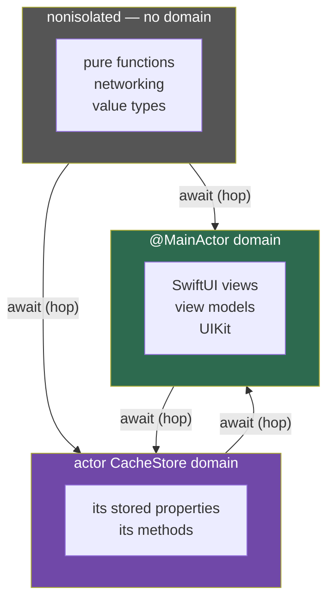

# Module 03 — Isolation: The Core Concept

> Roadmap: [[00 - Roadmap]] · Terms: [[Glossary]] · Prev: [[02 - Async Await Deep Dive]] ·
> Next: [[04 - Actors]] · While coding: [[00 - Decision Procedure]]
> **Goal:** look at any declaration and state its isolation, and say *how you know*.
> Drill: [[Drill 03 - Reading Isolation]]

---

## 0. Why this module exists

Everything that confuses people about Swift concurrency is an isolation question in disguise.

- "Why won't this compile?" → you crossed an isolation boundary with something that can't cross.
- "Why is this on the main thread?" → because the declaration is main-actor-isolated.
- "Why did my state change?" → because you suspended and another job in your domain ran.
- "What do I do now?" → find the domain that should own this, and put the code in it.

`Sendable`, actors, `@MainActor`, `@concurrent`, `sending` — these are not five topics. They
are five parts of one topic, and this is it. **Read this module twice.**

---

## 1. The one idea

> **Isolation is a compile-time property of a declaration that says which isolation domain
> its code and state belong to.**

Unpack that sentence, because every word is load-bearing.

**"Compile-time"** — isolation is decided when the code is compiled, not when it is called.
The same function has the same isolation regardless of who calls it or what thread they're on.
This is why "I called it from the main thread so it runs on the main thread" is false.

**"Of a declaration"** — it attaches to the *thing you wrote*: a function, a property, a type,
a closure. Not to a value, not to a thread, not to a call.

**"Isolation domain"** — a region the compiler guarantees is entered by one thing at a time.
Code in the same domain cannot run concurrently with itself. That guarantee is the entire
product; everything else is bookkeeping to preserve it.

A useful reframing: **isolation is a static type-system feature that happens to have a runtime
consequence.** Think of it the way you think of `throws` — part of the signature, checked at
compile time, and it changes how callers must call you.

---

## 2. Three kinds of domain

Every declaration belongs to one of three *kinds*. `@MainActor` is not a fourth category —
it is a **global actor**. A custom `@globalActor` (module 05) is the same kind: one
process-wide serial domain, just not the main thread.



| Domain | Guarantee | Runs on |
| :--- | :--- | :--- |
| `@MainActor` | Serialised with all other main-actor code, process-wide | The main thread, always |
| `actor Foo` | Serialised with all other code isolated to **that instance** | That actor's serial executor (a pool thread) |
| `nonisolated` | **None.** May run concurrently with anything, including itself | Wherever the runtime decides |

Three things that surprise people:

**1. `nonisolated` is not "background".** It means *unprotected*. A nonisolated function
called from main-actor code may well execute on the main thread — it just carries no promise
about it. Under Swift 6.2's approachable-concurrency defaults, a `nonisolated async` function
runs on the *caller's* executor, so it very often is main. `nonisolated` describes the absence
of a guarantee, not the presence of a thread.

**2. Each actor *instance* is its own domain.** Two instances of the same actor type can run
their methods simultaneously. A **global** actor (`@MainActor`, or `@DatabaseActor`) is
special because there is exactly one of it.

**3. `nonisolated` is the safest place to be, not the most dangerous.** Code with no mutable
state needs no protection. A `nonisolated func parse(_ data: Data) -> Model` is perfectly safe and maximally reusable. The goal is not to isolate everything — it's to isolate exactly the
mutable state and leave the rest free.

---

## 3. How isolation is actually determined

Here is the thing no tutorial writes down plainly. When you don't see an annotation, isolation
comes from somewhere else. In roughly descending precedence:

### 3.1 — Explicit annotation

```swift
@MainActor func updateUI() { }            // main-actor-isolated
nonisolated func parse() -> Model { }     // explicitly no domain
```

### 3.2 — The enclosing type

```swift
@MainActor
final class ProfileViewModel {
    var name = ""                  // @MainActor — inherited from the type
    func refresh() { }             // @MainActor — inherited from the type
    nonisolated func id() -> UUID  // opted out explicitly
}

actor ImageCache {
    var store: [URL: Data] = [:]   // actor-isolated to this instance
    func insert(_ d: Data, for u: URL) { }   // actor-isolated
}
```

This is where most inference comes from, and it's why "the function looks plain" is not
evidence of anything until you've looked at its container.

### 3.3 — Protocol conformance

A protocol can carry isolation, and conforming **silently isolates your type**:

```swift
@MainActor protocol Presenting {
    func present()
}

final class Coordinator: Presenting {     // the whole class becomes @MainActor-inferred
    func present() { }                    // @MainActor, though nothing here says so
}
```

`SwiftUI.View` is `@MainActor`. `UIViewController` is `@MainActor`. This is why your app code
is already largely main-actor-isolated whether or not you asked for it — and why adding
`@MainActor` to a view model usually changes nothing at runtime and fixes twenty errors.

### 3.4 — Superclass

```swift
class Base { @MainActor func run() { } }
class Sub: Base { override func run() { } }   // still @MainActor
```

You cannot widen isolation in an override. Subclasses inherit their superclass's isolation.

### 3.5 — The module default ⚠️

```

SWIFT_DEFAULT_ACTOR_ISOLATION = MainActor    // Xcode 26 default for new projects
```

With this set, **an unannotated declaration is `@MainActor`**. The same source file, copied
into a Swift package without the setting, is `nonisolated`.

> This is the single most common reason two people looking at identical code disagree about
> what it does. Before reasoning about any file, know this setting for **that module**.
> Packages you depend on almost certainly don't have it.

### 3.6 — Closures: the part that trips everyone

Closures inherit isolation from their **lexical context** — where they're written — but only
if they are non-`Sendable`:

```swift
@MainActor
func example() {
    let items = [1, 2, 3]

    items.forEach { _ in
        here("forEach")        // @MainActor — non-escaping, inherits
    }

    Task {
        here("Task")           // @MainActor — Task inherits enclosing isolation
    }

    Task.detached {
        here("detached")       // nonisolated — detached inherits NOTHING
    }

    DispatchQueue.global().async {
        here("GCD")            // nonisolated — @Sendable closure, no inheritance
    }
}
```

The rule: **`@Sendable` closures do not inherit isolation.** That is what `@Sendable` *means*
in this context — "this closure might run in another domain, so it can't assume one."

And the counterexample from [[01 - Mental Model]] §4.1, which is worth re-reading now that you
have the vocabulary: a `Task { }` inside a `nonisolated` function that *happens to be running
on the main thread* is still nonisolated, because it inherited the **context**, not the thread.

---

## 4. Boundaries and hops

An **isolation boundary** is the line between two domains. Crossing it requires two things:

1. **A suspension point** — you cross at an `await`, never silently. This is why calling an
   actor method from outside requires `await` even when the method isn't `async`.
2. **The value must be safe to move** — that's `Sendable`, covered in
   [[06 - Sendable and Data-Race Safety]].

```swift
actor Counter {
    private var value = 0
    func increment() { value += 1 }      // not async...
    func get() -> Int { value }
}

@MainActor
func useIt(_ c: Counter) async {
    await c.increment()   // ...but `await` is required: we're crossing a boundary
    let v = await c.get()
    print(v)
}
```

`increment()` is synchronous *from inside the actor*. From outside it is asynchronous, because
getting in requires waiting your turn. **Async-ness here is a property of the boundary, not of
the function.** Once that clicks, a lot of apparently arbitrary `await` requirements become
obvious.

The runtime act of moving between domains is a **hop**. Hops cost something (a scheduling
round-trip, and for `@MainActor` a hop to the main thread), which is why chatty cross-domain
call patterns are slow — see §7.3.

---

## 5. Reading isolation off code — worked examples

Cover the answers. For each, say the isolation **and how you know**.

```swift
// ── A ──────────────────────────────────────────
struct ContentView: View {
    @State private var name = ""
    var body: some View { Text(name) }
    func helper() { }
}
```
<details><summary>Answer</summary>

`@MainActor`, all of it. `View` is a `@MainActor` protocol (§3.3), so conformance isolates the
type, and `helper()` inherits from the type (§3.2). Nothing in the source says `@MainActor` —
this is pure inference, and it's why SwiftUI code "just works" on main.
</details>

```swift
// ── B ──────────────────────────────────────────
actor Downloader {
    var active: Set<URL> = []
    nonisolated let session = URLSession.shared
    nonisolated func cacheKey(for url: URL) -> String { url.absoluteString }
    func begin(_ url: URL) { active.insert(url) }
}
```
<details><summary>Answer</summary>

`active` and `begin` are isolated to **this instance** of `Downloader`. `session` and
`cacheKey` are nonisolated — legal because `session` is a `let` of a `Sendable` type and
`cacheKey` touches no actor state. This is the standard shape: isolate the mutable state,
leave the pure functions free so callers don't need to `await` them.
</details>

```swift
// ── C ──────────────────────────────────────────
final class Analytics {
    static let shared = Analytics()
    private var events: [String] = []
    func log(_ e: String) { events.append(e) }
}
```
<details><summary>Answer</summary>

Nonisolated, and **this is a data race** — a shared singleton with unprotected mutable state.
Under Swift 6 the `static let shared` is an error unless `Analytics` is `Sendable`, which it
isn't. This is the single most common Swift 6 migration failure in real codebases. Fix:
`actor Analytics`, or `@MainActor final class`, or a `Mutex` around `events`.
</details>

```swift
// ── D ──────────────────────────────────────────
@MainActor
final class Player {
    var isPlaying = false

    func start() {
        Task.detached {
            await self.reallyStart()      // why is `await` needed?
        }
    }
    func reallyStart() { isPlaying = true }
}
```
<details><summary>Answer</summary>

`Player` and both methods are `@MainActor`. The `Task.detached` closure is **nonisolated** —
detached inherits nothing (§3.6) — so calling `reallyStart()` from inside it crosses a
boundary and needs `await`. The `await` is your visible evidence of the hop.

Also: this code is pointless. It leaves main only to immediately hop back. Delete the
`Task.detached` and call `reallyStart()` directly. This pattern appears constantly in real
code and is almost always someone silencing an error they didn't understand — exactly the
🚩 from Q3 of [[00 - Decision Procedure]].
</details>

```swift
// ── E ──────────────────────────────────────────
nonisolated func process(_ items: [Int]) async -> Int {
    items.reduce(0, +)
}
```
<details><summary>Answer</summary>

Nonisolated — explicitly. But under Swift 6.2 approachable-concurrency defaults, it runs on
**the caller's executor** (`nonisolated(nonsending)`), so calling it from `@MainActor` code
runs it on the main thread. If you want it off main you need `@concurrent`. See
[[11 - Swift 6.2 and Modern Defaults]].

Worth noticing: this function has no reason to be `async` at all. Drop `async` and it's a
plain synchronous function callable from anywhere with zero ceremony.
</details>

---

## 6. The escape hatches

Four tools for when the defaults don't fit. Each is a promise you make to the compiler.

### `nonisolated` — opt a member out of its type's domain

```swift
@MainActor
final class ViewModel {
    let id: UUID                                   // immutable, Sendable
    nonisolated var debugName: String { "VM-\(id)" }  // callable without await
}
```
Legal only if the member touches no isolated mutable state. Use it to spare callers a hop.

### `isolated` parameters — take the domain as an argument

```swift
func report(on cache: isolated ImageCache) {
    print(cache.store.count)     // direct access, no await — we ARE on that actor
}
await report(on: myCache)        // the hop happens at the call
```

Underused and excellent. Instead of making five separate `await` calls into an actor, hop once
and do all five. This is the fix for the chatty-boundary performance problem in §7.3.

### `#isolation` — capture the caller's domain

```swift
func run(isolation: isolated (any Actor)? = #isolation) async { }
```
The macro resolves to the caller's isolation at the call site, letting a generic helper stay in
whatever domain called it. You'll meet this in library code (it's how `withCheckedContinuation`
avoids unwanted hops) more often than you'll write it.

### `@concurrent` — force off the caller's executor

```swift
@concurrent nonisolated func thumbnail(from data: Data) async -> Image {
    // genuinely CPU-heavy; must not occupy the caller's actor
}
```
Swift 6.2. The *only* reliable way to guarantee an async function leaves the caller's domain
under approachable-concurrency defaults. See [[11 - Swift 6.2 and Modern Defaults]].

---

## 7. Pitfalls

**7.1 — Believing isolation propagates at runtime.** It does not. There is no mechanism that
reads the current thread and carries it forward. Say it out loud once: *isolation is static.*

**7.2 — Sprinkling `@MainActor` until it compiles.** It will compile. You'll also have
serialised your whole app onto one thread and made every call a potential hop. Ask Q2 from
[[00 - Decision Procedure]] first: *what state am I protecting?* If the answer is "none",
`@MainActor` is the wrong tool — the code should be `nonisolated`.

**7.3 — Chatty boundaries.** Each of these is a separate hop:

```swift
// ❌ four hops, four scheduling round-trips
let a = await cache.count
let b = await cache.isEmpty
let c = await cache.oldest
await cache.trim()

// ✅ one hop — move the logic to where the data is
await cache.compactAndReport()
```
**Move the code to the data, not the data to the code.** This is the single most useful
performance heuristic in actor-based design, and it's why `isolated` parameters exist.

**7.4 — Assuming `nonisolated` means "runs in the background".** See §2. Under Xcode 26
defaults it usually doesn't. This is *the* misconception that survives longest.

**7.5 — Not knowing your module's default isolation.** You will read code, reason carefully,
and be wrong. Check the build setting first — for *each* module, since your app target and
your packages likely differ.

**7.6 — `@MainActor` on a whole type when one property needed it.** Isolate the smallest thing
that owns the state. Isolating a 400-line class because one property feeds a label is how
teams end up with everything on main and no idea how it happened.

---

## 8. Drill gate

→ **[[Drill 03 - Reading Isolation]]**

You're done with this module when you can, in the lab, predict the output of a file that mixes
all three domains — *before running it* — and be right. Not "understand it after." Predict it.

Log every wrong prediction in the Error Log in [[Progress]]. The wrong ones are the curriculum;
the right ones are just confirmation.
