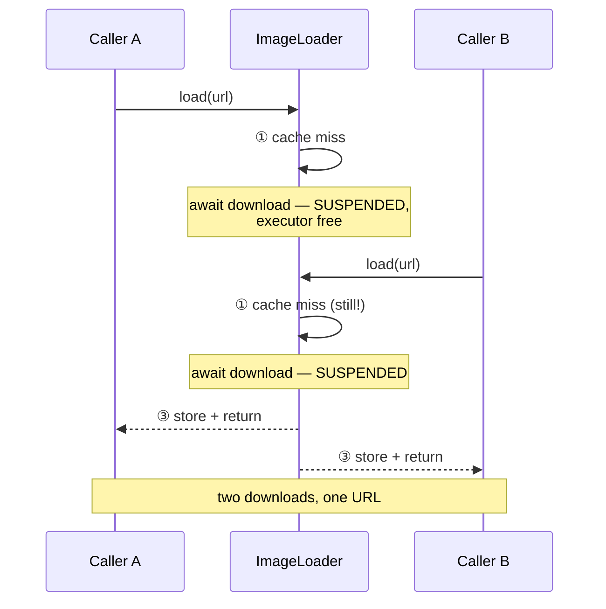

# Module 04 — Actors

> Roadmap: [[00 - Roadmap]] · Terms: [[Glossary]] · Prev: [[03 - Isolation - The Core Concept]] ·
> Next: [[05 - MainActor and Global Actors]]
> **Goal:** protect mutable state correctly, and be able to point at the exact line where a
> reentrancy bug lives. Drill: [[Drill 04 - The Reentrancy Bug]]

---

## 1. What an actor is

A reference type that owns its mutable state and guarantees **one caller at a time**.

```swift
actor ImageCache {
    private var store: [URL: Data] = [:]

    func image(for url: URL) -> Data? { store[url] }
    func insert(_ data: Data, for url: URL) { store[url] = data }
}
```

Mechanically: every actor has a **serial executor**. Calls from outside become *jobs* enqueued
on it, and the executor runs one job at a time. That's it — actors are a queue with
compiler-enforced access rules.

The compiler's contribution is the important half:

- Isolated state is **unreachable** from outside without going through the executor
- Crossing in requires `await`, so boundaries are visible in the source
- Values crossing must be `Sendable` ([[06 - Sendable and Data-Race Safety]])

Compare with the GCD version you've written a hundred times:

```swift
// The old way — correct only if you never forget
final class ImageCache {
    private var store: [URL: Data] = [:]
    private let queue = DispatchQueue(label: "cache")

    func image(for url: URL) -> Data? {
        queue.sync { store[url] }          // forget .sync once → race, silently
    }
    func insert(_ data: Data, for url: URL) {
        queue.async { self.store[url] = data }
    }
}
```

Nothing stops you touching `store` directly and shipping a race. With an actor, that line
doesn't compile. **The discipline moved from your memory into the type system.**

---

## 2. Inside vs outside

The same method has two faces:

```swift
actor Counter {
    private var value = 0

    func increment() { value += 1 }
    func addAll(_ ns: [Int]) {
        for n in ns { value += n }      // inside: synchronous, direct access
    }
}

func caller(_ c: Counter) async {
    await c.increment()                 // outside: await required
    let v = await c.value               // reading is a hop too
}
```

| From | Access | Why |
| :--- | :--- | :--- |
| Inside the actor | Synchronous, direct | You're already on the executor; it's your turn |
| Outside | `await` required | You must wait your turn |

**Async-ness is a property of the boundary, not the function.** `increment()` is not declared
`async` — it becomes async *from the outside* because entering the domain can suspend.

`let` properties of `Sendable` type are readable without `await`, because immutable data can't
race:

```swift
actor Session {
    let id: UUID                        // no await needed from outside
    private var token: String?          // await required
}
```

---

## 3. `nonisolated` members

Opt out when a member doesn't touch isolated mutable state:

```swift
actor Downloader {
    private var inFlight: Set<URL> = []
    nonisolated let session: URLSession

    nonisolated func cacheKey(for url: URL) -> String {   // pure — no await for callers
        url.absoluteString.hashValue.description
    }

    nonisolated func describe() -> String {
        "\(inFlight.count) active"       // ❌ error: actor-isolated property
    }
}
```

Use it for pure helpers, `Sendable` constants, and — importantly — protocol conformances:

```swift
extension Downloader: CustomStringConvertible {
    nonisolated var description: String { "Downloader" }
}
```

`CustomStringConvertible.description` is synchronous and nonisolated. An actor can only satisfy
it with a `nonisolated` member. This is the general shape of "my actor won't conform to this
protocol": **synchronous protocol requirements can only be met by nonisolated members**, so
either the member avoids isolated state or the protocol needs `async` requirements.

---

## 4. Reentrancy — the thing that will bite you ⚠️

This is the most important section in the module. Read it twice.

> **Actors are reentrant.** While an isolated method is suspended at an `await`, the actor is
> free to run **other jobs, including another call to the same method**.

Actors guarantee there's no *data race*. They do **not** guarantee your *invariants* survive a
suspension. Those are completely different promises, and conflating them is the #1 source of
"but I used an actor, why is this broken?"

### The canonical bug

```swift
actor ImageLoader {
    private var cache: [URL: Data] = [:]

    func load(_ url: URL) async throws -> Data {
        if let hit = cache[url] { return hit }          // ① check

        let data = try await download(url)              // ② SUSPEND ⚠️

        cache[url] = data                               // ③ store
        return data
    }
}
```

Two callers, same URL, at the same time:

```
Caller A: ① miss → ② suspends downloading
Caller B: ① miss (A hasn't stored yet!) → ② suspends downloading
Caller A: ③ stores
Caller B: ③ stores again
```

**Two downloads.** No data race — every access to `cache` was properly serialised — but the
cache did not do its job. If the operation were "charge the user" instead of "download an
image", this would be a billing bug.



### Fix 1 — re-check after the await

Cheapest fix. Doesn't prevent duplicate work, but keeps state consistent:

```swift
let data = try await download(url)
if let winner = cache[url] { return winner }   // someone beat us; use theirs
cache[url] = data
return data
```

### Fix 2 — store the task, not the value ✅

The idiomatic answer. Callers **join** the in-flight work instead of duplicating it:

```swift
actor ImageLoader {
    private enum Entry { case loading(Task<Data, Error>), ready(Data) }
    private var cache: [URL: Entry] = [:]

    func load(_ url: URL) async throws -> Data {
        switch cache[url] {
        case .ready(let data):     return data
        case .loading(let task):   return try await task.value   // join, don't duplicate
        case nil:                  break
        }

        let task = Task { try await download(url) }
        cache[url] = .loading(task)                  // published BEFORE any suspension

        do {
            let data = try await task.value
            cache[url] = .ready(data)
            return data
        } catch {
            cache[url] = nil                         // don't cache failures
            throw error
        }
    }
}
```

The key line is `cache[url] = .loading(task)` **before** the first `await`. Between creating
the task and storing it there is no suspension point, so no other job can interleave. Learn
this pattern — it's the standard shape for deduplicating any async work.

### How to spot reentrancy bugs by reading

> Find every `await` inside actor methods. For each one, ask: **"what did I assume before this
> line that another call could invalidate?"**

Any `check → await → act` sequence on shared state is suspect. Common instances:

| Pattern | The bug |
| :--- | :--- |
| `if !cache.has(x) { await fetch(); cache.set(x) }` | duplicate fetches |
| `if !isLoading { isLoading = true; await work(); isLoading = false }` | flag stomped by second caller |
| `let n = count; await save(); count = n + 1` | lost update |
| `guard items.isEmpty else { return }; items = await load()` | double load |

> **Why doesn't Swift just make actors non-reentrant?** Because that deadlocks. If an actor
> couldn't accept new work while suspended, A→B→A would hang forever. Reentrancy is the price
> of deadlock freedom, and it's the right trade — but it's a trade *you* have to hold.

---

## 5. Actor isolation is per-instance

```swift
let a = Counter(), b = Counter()
async let x: () = a.increment()     // these two run
async let y: () = b.increment()     // genuinely in parallel
```

Two instances = two executors = two domains. This is why actors scale where a single global
queue doesn't — and why `@MainActor` is different: there is exactly one of it, so everything
main-actor-isolated contends for the same executor.

---

## 6. Actor initialisers

Initialisers are nonisolated until the actor is fully initialised, which has one practical
consequence:

```swift
actor Store {
    var items: [Item] = []

    init() {
        Task { await self.load() }    // ⚠️ escapes self before init completes
    }
    init(items: [Item]) {
        self.items = items            // ✅ synchronous setup is fine
    }
}
```

Kicking off async work from `init` means the actor can be used before that work finishes.
Prefer an explicit `func start() async` the owner calls, or a static factory:

```swift
static func loaded() async throws -> Store {
    let s = Store()
    try await s.load()
    return s
}
```

This is the same discipline as "don't escape `self` from `init`" in ordinary Swift — the
concurrency version just has sharper teeth.

---

## 7. When *not* to use an actor

Actors are not the default answer. Reach for something else when:

| Situation | Better tool |
| :--- | :--- |
| State is only touched from UI | `@MainActor` — you already have a domain |
| The data is immutable | nothing; `let` + `Sendable` |
| You need synchronous access from sync code | `Mutex` (`Synchronization`) or `OSAllocatedUnfairLock` |
| It's a pure transformation | `nonisolated func`; no state, no protection |
| A struct would do | a struct — copies don't race |

`Mutex` deserves a mention because it's the right answer more often than people expect:

```swift
import Synchronization

final class Metrics: Sendable {
    private let counts = Mutex<[String: Int]>([:])

    func bump(_ key: String) {                    // synchronous! no await, no async caller
        counts.withLock { $0[key, default: 0] += 1 }
    }
}
```

When the critical section is tiny and non-suspending, a `Mutex` avoids making every caller
`async` — which can otherwise cascade `async` through your whole codebase for the sake of
incrementing an integer. **Never `await` inside `withLock`.** The API prevents it, and that
restriction is the point: locks and suspension don't mix.

> Rule of thumb: **actor when the critical section contains `await`; `Mutex` when it doesn't.**

---

## 8. Pitfalls

**8.1 — Thinking actors prevent all concurrency bugs.** They prevent data races. Reentrancy,
deadlock-by-blocking, and ordering bugs are all still available to you.

**8.2 — `await` inside a loop over an actor.** `for x in items { await actor.add(x) }` is N
hops. Pass the whole array in one call.

**8.3 — Assuming FIFO ordering.** Actors do **not** guarantee jobs run in submission order.
Priority and reentrancy both reorder. If you need ordering, model it explicitly (a queue
inside the actor, or an `AsyncStream`).

**8.4 — Making everything an actor.** Actor hops aren't free, and an actor whose methods never
suspend is a slower `Mutex` that infected every caller with `async`.

**8.5 — Using an actor for UI state.** Use `@MainActor`. An actor means "some background
serial domain"; your views need *the main one* specifically.

**8.6 — Holding a reference to actor-isolated state outside the actor.** Returning an inner
`class` from an actor method hands out an unprotected pointer to the state you just protected.
Return value types.

---

## 9. Drill gate

→ **[[Drill 04 - The Reentrancy Bug]]**

You must **produce the duplicate download**, observe it in the console, and then fix it with
the task-caching pattern from §4. Producing the bug is the whole point — an actor bug you
haven't seen fire is one you won't recognise in review.
