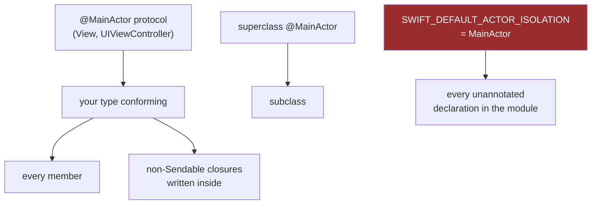

# Module 05 — @MainActor and Global Actors

> Terms: [[Glossary]] · Prev: [[04 - Actors]] ·
> Next: [[06 - Sendable and Data-Race Safety]]
> **Goal:** know exactly how `@MainActor` spreads through a codebase, and stop fighting it.
> Drill: [[Drill 05 - MainActor Propagation]]

---

## 1. `@MainActor` is just an actor with one instance

```swift
@globalActor
actor MainActor {
    static let shared: MainActor      // exactly one, process-wide
}
```

Everything from [[04 - Actors]] applies: serial executor, `await` to enter, reentrancy, the
lot. Two differences:

1. Its executor is **the main thread**, not a pool thread.
2. It's a **global** actor, so you can annotate declarations with it anywhere.

That's the whole concept. `@MainActor` is not special magic — it's the actor you were already
using informally every time you wrote `DispatchQueue.main.async`, with the compiler now
checking that you did it.

---

## 2. What you can annotate

```swift
@MainActor final class ViewModel { }          // every member
@MainActor var cachedImage: UIImage?          // one property (incl. globals)
@MainActor func updateLabel() { }             // one function
@MainActor protocol Presenting { }            // every conformer (⚠️ spreads — §3)

Task { @MainActor in                          // a closure
    label.text = "done"
}
```

The global-variable case is worth calling out, because it's the one Swift 6 breaks most often:

```swift
var sharedFormatter = DateFormatter()          // ❌ Swift 6: global mutable state
@MainActor var sharedFormatter = DateFormatter()   // ✅ isolated
let maxAge: TimeInterval = 60                      // ✅ Sendable value type
```

---

## 3. How it spreads

This is the part worth internalising, because in practice you rarely *write* `@MainActor` —
you *inherit* it.



The four vectors, in the order you'll actually encounter them:

**Protocol conformance.** `SwiftUI.View` and `UIViewController` are `@MainActor`. Conform, and
your type is isolated — no annotation appears in your source. This is why most app code is
already on the main actor.

**Superclass.** An override cannot drop the isolation of the method it overrides.

**Module default.** `SWIFT_DEFAULT_ACTOR_ISOLATION = MainActor` (Xcode 26 default) makes every
unannotated declaration main-isolated. Your app target likely has it; your packages likely
don't. See [[11 - Swift 6.2 and Modern Defaults]].

**Lexical capture.** Non-`Sendable` closures written inside main-actor code inherit it —
including `Task { }`.

> **Practical consequence:** when you add `@MainActor` to a view model to fix errors, you are
> usually not changing runtime behaviour at all. The code was already running on main. You are
> writing down a fact the compiler couldn't otherwise verify. That reframing removes most of
> the anxiety about "am I hurting performance by adding @MainActor?"

---

## 4. Getting onto the main actor

Four tools. Pick by what you have.

### From async code: just call it

```swift
func load() async {
    let data = try? await fetch()        // nonisolated work
    await viewModel.update(data)         // hop — the await IS the hop
}
```

### From sync code: `Task { @MainActor in }`

```swift
func legacyCallback() {
    Task { @MainActor in
        self.label.text = "updated"
    }
}
```
Note this is **asynchronous** — the update lands on a later turn of the main run loop, not now.

### `MainActor.run` — inside existing async code

```swift
func process() async {
    let result = compute()
    await MainActor.run {
        self.label.text = result
    }
}
```
Useful when only a few lines need main. Don't reach for it reflexively — if the whole function
belongs on main, annotate the function instead. Scattered `MainActor.run` blocks are usually a
sign that Q1 of [[00 - Decision Procedure]] was answered wrong.

### `MainActor.assumeIsolated` — you're *already* on main, synchronously ⚠️

```swift
nonisolated func delegateCallbackKnownToBeOnMain() {
    MainActor.assumeIsolated {
        self.label.text = "updated"      // synchronous, no hop, no await
    }
}
```

This asserts "I am already on the main thread" and **traps at runtime if you're wrong**. It's
the right tool for legacy delegate callbacks that are documented to fire on main but aren't
annotated. It is the wrong tool for making an error go away.

| | Hops? | Async? | If you're wrong |
| :--- | :--- | :--- | :--- |
| `await` a main-actor func | yes | yes | — |
| `Task { @MainActor in }` | yes | yes (later turn) | — |
| `MainActor.run { }` | yes | yes | — |
| `assumeIsolated { }` | **no** | **no** | 💥 crash |

> The better fix for a legacy delegate is usually `@preconcurrency` on the protocol
> conformance, or marking the delegate method `@MainActor` — see [[12 - Migrating to Swift 6]].
> Reserve `assumeIsolated` for cases where you genuinely can't change the declaration.

---

## 5. Custom global actors

When you want a shared serial domain that **isn't** main:

```swift
@globalActor
actor DatabaseActor {
    static let shared = DatabaseActor()
}

@DatabaseActor
final class UserStore {
    private var connection: SQLiteConnection?
    func save(_ user: User) { }
}

@DatabaseActor func migrate() async { }
```

Every declaration marked `@DatabaseActor` shares **one** executor process-wide. Use when:

- A resource requires serialised access globally (a DB handle, a file, a hardware device)
- You want a named domain spanning several types
- A C library demands all calls come from one thread

Don't use one where a plain `actor` instance works. A global actor is a process-wide
singleton domain, and singletons have the usual costs — everything annotated with it contends
for the same executor.

> **Custom executors.** An actor can supply its own executor via `unownedExecutor` — e.g. to
> pin an actor to a specific `DispatchQueue` you're migrating away from. Genuinely useful in
> migrations, rarely needed otherwise. Worth knowing it exists; skip until you need it.

---

## 6. SwiftUI specifics

```swift
struct ProfileView: View {                 // View is @MainActor → all of this is main
    @State private var profile: Profile?

    var body: some View {
        content
            .task { await load() }         // ① auto-cancelled on disappear
            .refreshable { await load() }  // ② main-actor async context
            .onAppear { Task { await load() } }   // ③ NOT auto-cancelled ⚠️
    }

    func load() async { profile = try? await api.fetch() }   // @MainActor
}
```

**Prefer ① over ③.** `.task` ties the task's lifetime to the view's — when the view
disappears, the task is cancelled. `.onAppear { Task { } }` leaks work that outlives the view,
which is how you get "why did a response arrive for a screen the user closed?"

`.task(id:)` restarts when the id changes, which is the right way to react to a changing
selection:

```swift
.task(id: userID) { await load(userID) }   // cancels the old load, starts a new one
```

**`@Observable` and isolation.** An `@Observable` class used by views should be `@MainActor`.
Its properties are read during view body evaluation, which is main-actor work; if the object
isn't isolated, you get either Swift 6 errors or the classic "Publishing changes from
background threads" runtime warning.

```swift
@MainActor @Observable final class ProfileModel {
    var profile: Profile?
    func load() async {
        let fetched = try? await api.fetch()   // suspends; does not by itself leave MainActor
        profile = fetched                      // still on main — safe
    }
}
```

Note what this function does: it's main-actor-isolated *throughout*. If `api.fetch()` is
ordinary `nonisolated async` under 6.2 approachable-concurrency defaults, the `await`
**suspends on the main actor** — it frees the main thread during the network wait, but it
does not hop to the cooperative pool. **Being on the main actor does not mean blocking the
main thread.** That is the point people miss when they prematurely push view-model code off
main. Use `@concurrent` only when the work is CPU-bound and must actually leave.

---

## 7. Pitfalls

**7.1 — `@MainActor` everywhere as an error-silencing tactic.** It compiles, and then every
call is a potential hop and nothing runs concurrently. Isolate the state, not the universe.

**7.2 — Heavy work on the main actor.** The isolation is correct; the *work* is the problem.
Move the computation out with `@concurrent nonisolated`, then hop back for the result:

```swift
@MainActor
func render() async {
    let img = await makeThumbnail(data)   // @concurrent — runs off main
    imageView.image = img                 // back on main
}
```

**7.3 — `assumeIsolated` as a crash you haven't had yet.** If you can't prove the caller is on
main, don't use it.

**7.4 — Forgetting `Task { }` is asynchronous.** `Task { @MainActor in ... }` from inside
main-actor code does not run now — it runs on a later turn. If you needed it now, you were
already on the main actor and could have just written the line.

**7.5 — `DispatchQueue.main.async` in new code.** It does the same hop with none of the
checking. `Task { @MainActor in }` is the modern equivalent and the compiler can reason about
it. (One exception: `DispatchQueue.main.async` from a context where you genuinely cannot start
a task, e.g. some C callbacks.)

**7.6 — A `@MainActor` type with a `deinit` that touches isolated state.** `deinit` runs
wherever the last reference is released. Swift 6.2's `isolated deinit` addresses this; until
you adopt it, keep `deinit` trivial.

---

## 8. Drill gate

→ **[[Drill 05 - MainActor Propagation]]**

You're done when you can look at a type with no `@MainActor` in its source and correctly state
whether it's main-isolated — and name *which* of the four vectors in §3 put it there.
