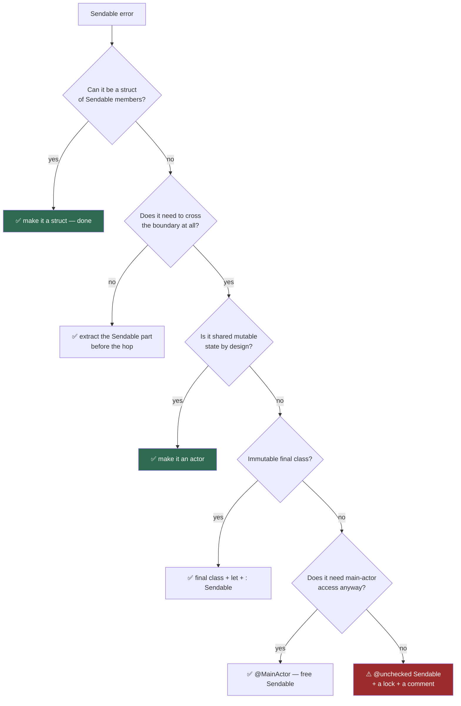

# Module 06 — Sendable and Data-Race Safety

> Roadmap: [[00 - Roadmap]] · Terms: [[Glossary]] · Prev: [[05 - MainActor and Global Actors]] ·
> Next: [[07 - Bridging Legacy Code]]
> **Goal:** read any `Sendable` error and know the fix immediately.
> Drill: [[Drill 06 - Making It Sendable]]

---

## 1. The question `Sendable` answers

Isolation ([[03 - Isolation - The Core Concept]]) says *where code runs*. `Sendable` says
*what may move between those places*.

> **`Sendable` means: it is safe for this value to be used from more than one isolation domain
> at a time.**

It's a **marker protocol** — no requirements, no methods. It exists purely so the compiler can
check something it otherwise couldn't:

```swift
actor Cache { func store(_ x: Something) { } }

@MainActor
func send(_ x: Something, to cache: Cache) async {
    await cache.store(x)      // x crosses a boundary → must be Sendable
}
```

If `Something` is a mutable class, both domains now hold the same object and can mutate it
concurrently. That's a data race, and it's exactly what the compiler is refusing to let you do.

> **The mental shortcut:** `Sendable` = "copied, or immutable, or internally synchronised."
> Anything else is a shared mutable reference, and shared mutable references are the problem.

---

## 2. Who gets it automatically

| Type | `Sendable`? | Condition |
| :--- | :--- | :--- |
| `struct` / `enum` | ✅ implicit | All stored properties/payloads are `Sendable` |
| `actor` | ✅ always | Its state is protected by definition |
| `final class` with only `let`s | ✅ if you write `: Sendable` | All properties `Sendable` & immutable |
| `class` (non-final, or any `var`) | ❌ | Mutable shared state |
| `@MainActor` class | ✅ implicit | Isolation *is* the protection |
| Function/closure | only if `@Sendable` | — |
| `Int`, `String`, `Data`, `URL`, `UUID`, `Date` | ✅ | — |
| `Array`/`Dictionary`/`Optional` | ✅ conditional | If `Element` is `Sendable` |

Two entries deserve emphasis:

**`@MainActor final class ViewModel` is `Sendable` for free.** People add `@unchecked
Sendable` to view models constantly without realising isolation already gave it to them. If
it's isolated, it's sendable — the domain does the protecting.

**Implicit conformance is internal-only.** A `public struct` in a package does *not* get
public `Sendable` conformance implicitly; you must write it:

```swift
public struct User: Sendable {            // the `: Sendable` is required for public API
    public let id: UUID
    public let name: String
}
```
This trips up every package author exactly once.

---

## 3. The decision tree

When the compiler says "does not conform to Sendable", walk this. **Stop at the first yes** —
the options are in order of preference, and reaching for #5 first is how codebases end up with
races the compiler could have caught.



### Option 2 in practice — don't send the whole object

The most underused fix. You rarely need the object; you need two fields of it:

```swift
// ❌ sends a whole non-Sendable view controller
await cache.store(viewController)

// ✅ send what you actually need
let snapshot = Snapshot(id: viewController.id, title: viewController.title)
await cache.store(snapshot)     // Snapshot is a struct of Sendable members
```

This is almost always the right answer when the error involves a UI type, and it usually
improves the design independently of concurrency.

---

## 4. `@Sendable` closures

A closure is `Sendable` when it can safely run in another domain — which requires that
**everything it captures is `Sendable`**, and that it doesn't capture mutable local state.

```swift
func schedule(_ work: @Sendable @escaping () -> Void) { }

func caller() {
    var counter = 0
    schedule { counter += 1 }        // ❌ captures mutable local var
    let items = [1, 2, 3]
    schedule { print(items) }        // ✅ [Int] is Sendable, captured immutably
}
```

`Task { }`, `Task.detached { }`, `withTaskGroup`'s child closures, and `DispatchQueue.async`
all take `@Sendable` closures. Which is why, per §3.6 of
[[03 - Isolation - The Core Concept]], **`@Sendable` closures don't inherit isolation** — a
closure that might run anywhere can't assume a domain.

`Task { }` is the interesting exception: it *does* inherit isolation, because its closure is
`@isolated(any)` — it captures the enclosing isolation and carries it along.

---

## 5. Region-based isolation and `sending`

Swift 6 is smarter than "is this type `Sendable`?" It tracks **regions** of values and can
prove a non-`Sendable` value is safe to transfer if the sender provably stops using it.

```swift
func process() async {
    var model = NonSendableModel()      // not Sendable
    model.configure()
    await actor.consume(model)          // ✅ allowed — `model` is not used again
    // touching `model` here would be an error
}
```

The compiler proved the value's region doesn't overlap after the transfer, so no two domains
hold it at once. This eliminates a large class of errors that Swift 5.10 would have rejected —
**if you hit a `Sendable` error on a value you never touch again, check you're on a Swift 6
compiler before redesigning anything.**

`sending` marks a parameter or return as transferred rather than shared:

```swift
func handOff(_ value: sending NonSendableThing) async { }
func make() -> sending NonSendableThing { NonSendableThing() }
```

Read `sending` as **"this value is moving, not being shared."** It's the precise tool for
factory functions and handoff APIs where `Sendable` is too strong a requirement.

---

## 6. The escape hatches

### `@unchecked Sendable`

"Trust me, I've synchronised this." Legitimate — with a real mechanism and a comment:

```swift
/// Thread-safe: all access to `storage` goes through `lock`.
final class LRUCache: @unchecked Sendable {
    private let lock = NSLock()
    private var storage: [String: Data] = [:]

    func value(for key: String) -> Data? {
        lock.withLock { storage[key] }
    }
}
```

Illegitimate, and depressingly common:

```swift
final class ViewModel: @unchecked Sendable {   // ❌ no synchronisation whatsoever
    var items: [Item] = []
}
```

That is a data race with a compiler warning switched off. **`@unchecked Sendable` without a
lock, a queue, or an atomic is a bug.** If you add one during migration, add a `// TODO:` with
it — see [[12 - Migrating to Swift 6]].

### `nonisolated(unsafe)`

Same promise, one declaration:

```swift
nonisolated(unsafe) var globalCache: [String: Data] = [:]
```

Useful for globals you're migrating incrementally, and for genuinely-immutable-after-setup
values the compiler can't see. Same rule: comment the invariant.

### `@preconcurrency`

Tells the compiler "this came from before concurrency checking; downgrade errors to warnings":

```swift
@preconcurrency import LegacyFramework
@preconcurrency protocol OldDelegate { }
```

The correct tool for third-party SDKs you can't change. Not a tool for your own code.

---

## 7. Common errors, decoded

**"Capture of 'self' with non-sendable type 'X' in a `@Sendable` closure"**
You used `self` inside `Task { }` / `DispatchQueue.async` from a non-`Sendable`, non-isolated
class. Fix: isolate the class (`@MainActor` or `actor`), or capture only the `Sendable` pieces.

**"Sending 'self' risks causing data races"**
Swift 6 region analysis: `self` is being transferred but the current domain keeps using it.
Fix: make the type `Sendable`/isolated, or don't transfer `self` — transfer a snapshot.

**"Main actor-isolated value of type 'X' passed as a strongly transferred parameter"**
You're handing main-actor-isolated state to another domain. Fix: extract a `Sendable` value
first.

**"Non-sendable type 'X' returned by implicitly asynchronous call to actor-isolated…"**
Your actor method returns a non-`Sendable` type. Anything leaving an actor must be `Sendable`
— otherwise you handed out an unprotected pointer to protected state. Return a value type.

**"Static property 'shared' is not concurrency-safe"**
The singleton problem. Fix: make the type an `actor`, or `@MainActor`, or immutable +
`Sendable`.

---

## 8. Pitfalls

**8.1 — `@unchecked Sendable` as a migration shortcut.** Every one is a race you've promised
doesn't exist. Keep a count; drive it to zero.

**8.2 — Forgetting `: Sendable` on public types.** Implicit conformance doesn't cross module
boundaries for public types. Your package compiles; your consumers get errors.

**8.3 — Assuming Foundation types are `Sendable`.** Many are; `NSMutableArray`,
`DateFormatter`, `NSManagedObject` and most UIKit types are not. Check, don't assume.

**8.4 — Making a type `Sendable` when it should be isolated.** If two domains genuinely need
the same *mutable* state, `Sendable` is the wrong question — you want an actor.

**8.5 — Over-engineering around region-based isolation.** If you never touch the value again,
Swift 6 probably already allows the transfer. Try compiling before redesigning.

---

## 9. Drill gate

→ **[[Drill 06 - Making It Sendable]]**

Six broken types, one per branch of the §3 tree. Fix each with the *cheapest correct* option —
and then write, for one of them, the `@unchecked Sendable` version and watch Thread Sanitizer
catch the race you just promised wasn't there.
