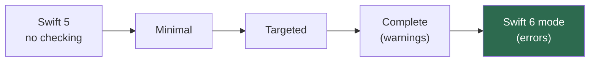

# Module 12 — Migrating to Swift 6

> Terms: [[Glossary]] · Prev: [[11 - Swift 6.2 and Modern Defaults]] ·
> Next: [[13 - Testing Concurrent Code]]
> **Goal:** take a real module to Swift 6 language mode without a rewrite and without
> `@unchecked Sendable`. Drill: [[Drill 12 - Migrate One Module]]

---

## 1. The strategy

> **Migrate one module at a time, and turn checking up in stages within each one.**

Swift 6 checking is per-module, which is the whole reason this is tractable. A Swift 6 module
can depend on Swift 5 modules and vice versa. You never need a big-bang migration, and
attempting one is the standard way to get the project abandoned halfway.



| Stage | Setting | What it checks |
| :--- | :--- | :--- |
| Minimal | `SWIFT_STRICT_CONCURRENCY = minimal` | Only explicit `Sendable` conformances |
| Targeted | `= targeted` | Code that already adopted concurrency |
| Complete | `= complete` | Everything — full data-race checking, as warnings |
| Swift 6 | `SWIFT_VERSION = 6.0` | Same checks, now **errors** |

The trick: **get to Complete-with-warnings and drive the warning count to zero before flipping
the language mode.** Warnings let you keep shipping while you work; errors don't.

---

## 2. Which module first

Migrate **bottom-up** — dependencies before dependents. A leaf module's `Sendable` annotations
make its consumers' migrations easier, and doing it the other way round means re-doing work.

```
1. Models / value types        ← almost free, huge payoff for everything above
2. Networking / persistence    ← mostly nonisolated + Sendable
3. Business logic / services   ← where the actors appear
4. Feature modules             ← mostly @MainActor
5. The app target              ← last
```

Start with your model layer. It's usually structs already, the changes are mechanical, and
every module above it immediately gets easier.

---

## 3. The error families, and the standard fix

In a real codebase, 90% of errors are five shapes.

### 3.1 — Global mutable state (the most common by far)

```swift
// ❌ "Var 'shared' is not concurrency-safe because it is nonisolated global shared mutable state"
var shared = Configuration()

// ✅ pick one:
let shared = Configuration()                   // if immutable & Sendable
@MainActor var shared = Configuration()        // if UI-owned
actor ConfigurationStore { }                   // if genuinely shared mutable
nonisolated(unsafe) var shared = Configuration()  // ⚠️ migration crutch only
```

### 3.2 — The singleton with mutable state

```swift
// ❌
final class Analytics {
    static let shared = Analytics()
    private var queue: [Event] = []
    func log(_ e: Event) { queue.append(e) }
}

// ✅
actor Analytics {
    static let shared = Analytics()
    private var queue: [Event] = []
    func log(_ e: Event) { queue.append(e) }     // callers now `await`
}
```

Watch the ripple: `await Analytics.shared.log(e)` requires an async context. If logging happens
in synchronous code all over the app, prefer a `Mutex`-backed `final class ... : Sendable`
instead — it keeps `log` synchronous and avoids `async` cascading through hundreds of call
sites for the sake of appending to an array. This trade-off is the most consequential judgment
call in most migrations.

### 3.3 — Delegate callbacks

```swift
// ❌ nonisolated protocol method touching @MainActor state
func urlSession(_ s: URLSession, task: URLSessionTask, didCompleteWithError e: Error?) {
    self.statusLabel.text = "done"
}

// ✅ if the API guarantees main:
nonisolated func urlSession(...) {
    MainActor.assumeIsolated { self.statusLabel.text = "done" }
}

// ✅ if it doesn't:
nonisolated func urlSession(...) {
    Task { @MainActor in self.statusLabel.text = "done" }
}
```

### 3.4 — Non-`Sendable` types crossing boundaries

Walk the tree in §3 of [[06 - Sendable and Data-Race Safety]]. The answer is usually "make the
model a struct" and it usually improves the code anyway.

### 3.5 — Third-party SDKs that haven't migrated

```swift
@preconcurrency import ThirdPartySDK
```

The correct tool. If a specific type needs it:

```swift
extension SDKType: @retroactive @unchecked Sendable { }   // ⚠️ you are asserting their safety
```
Only when you've checked their docs or source. You are making a promise about somebody else's
code.

---

## 4. A realistic sequence for one module

1. Set `SWIFT_STRICT_CONCURRENCY = complete`, keep `SWIFT_VERSION = 5.0`. Build. Count the
   warnings — this is your baseline and your burndown.
2. **Annotate, don't restructure.** First pass: add `@MainActor` where the code already runs on
   main, and `: Sendable` where types are already immutable. This is usually 60–70% of the
   warnings and changes zero runtime behaviour.
3. **Fix globals and singletons** (§3.1, §3.2). This is the batch with real design decisions in
   it; do it deliberately, not at 6pm on a Friday.
4. **Handle delegates and SDK boundaries** (§3.3, §3.5).
5. **Whatever is left** needs actual redesign. It's now a small, visible list rather than an
   overwhelming wall — which is the entire reason for doing steps 1–4 first.
6. Warnings at zero → flip `SWIFT_VERSION = 6.0`. If step 5 was honest, this is a no-op.
7. Run the test suite **with Thread Sanitizer on**. The compiler can't see through your
   `@unchecked` promises; TSan can.

> Track it. `xcodebuild ... 2>&1 | grep -c "warning:.*concurrency"` in CI, plotted over time,
> turns a vague slog into visible progress — and stops regressions creeping back in.

---

## 5. The `@unchecked Sendable` budget

You will be tempted. Keep a budget and make it visible:

```swift
// TODO(concurrency): @unchecked because `storage` is guarded by `lock`.
// Remove when this becomes an actor — tracked in TICKET-123.
final class LegacyCache: @unchecked Sendable { ... }
```

Rules that keep it honest:

- Every `@unchecked Sendable` has a comment naming the synchronisation mechanism.
- Every one has a ticket.
- The count is reported in CI and only goes down.
- **Zero of them are "I don't know why this errors."** That's not a migration crutch, that's
  shipping a race with the alarm disconnected.

Same rules for `nonisolated(unsafe)`.

---

## 6. What not to do

**Don't migrate everything at once.** You'll have a 400-file branch that can't be reviewed,
can't be shipped, and conflicts with everything.

**Don't add `@MainActor` everywhere to make it compile.** You'll serialise the app and the
performance problem will surface months later with no obvious cause.

**Don't use `@unchecked Sendable` to clear the backlog.** You'll have converted compile-time
safety into runtime crashes — the exact opposite of the migration's purpose.

**Don't skip Thread Sanitizer.** Compile-time checks only cover what the compiler can see.

**Don't migrate while also refactoring.** One or the other. A diff that both restructures a
feature and changes its isolation is unreviewable, and when something breaks you won't know
which half did it.

---

## 7. What you get

Worth stating, because at hour three of a migration it stops feeling obvious:

- Data races become **compile errors** instead of crashes that reproduce once a month on a user's device
- Isolation is **documented in the signature**, so new engineers can't get it wrong by accident
- Whole categories of bug — "published from background thread", torn reads, the flaky test
  nobody can reproduce — stop being possible
- You can reason about a function's threading by reading it, which is the thing you're actually
  buying

---

## 8. Drill gate

→ **[[Drill 12 - Migrate One Module]]**

Take a real module from an app you actually own — not a toy. Record the starting warning count
and the ending one, plus the number of `@unchecked Sendable` you needed. **If that number is
above zero, the drill isn't finished.**
